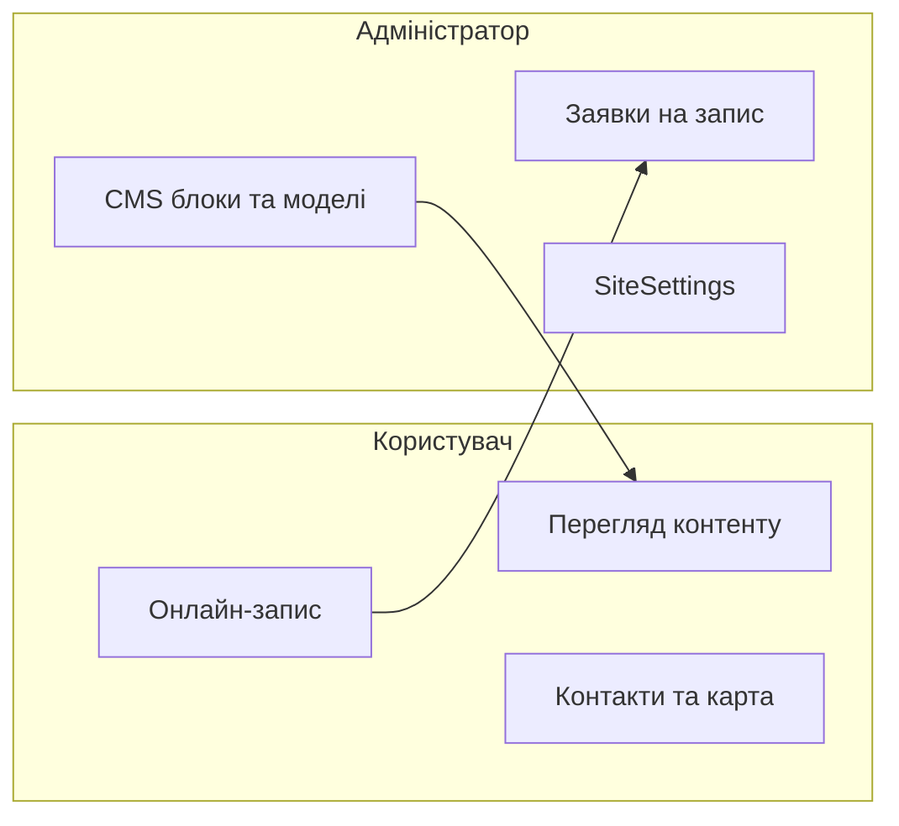
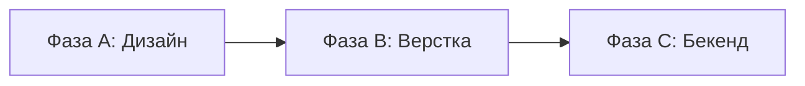
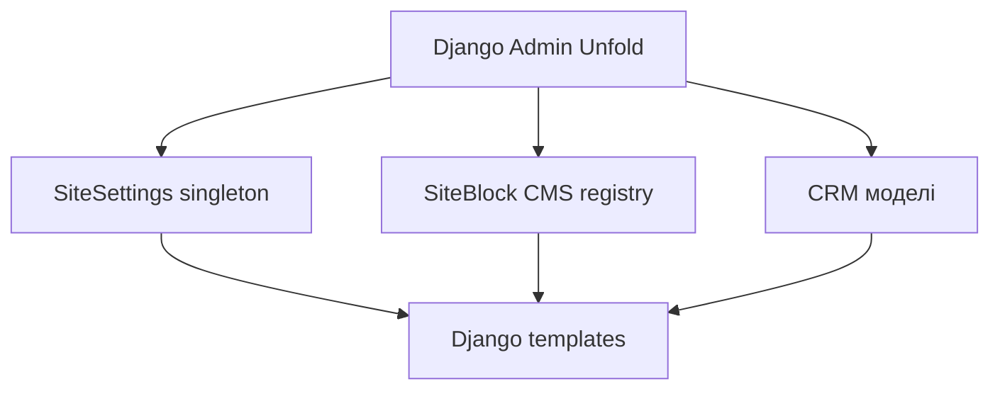

# Картка сайту

## TEN clinic — Medicine & Surgery

| Параметр | Значення |
|----------|----------|
| **Версія** | 1.1 |
| **Дата** | 30.06.2026 |
| **Тип** | Корпоративний сайт медичної клініки + онлайн-запис |
| **Мова** | Українська |
| **Підхід** | Чистий код · Mobile-first · Design → Frontend → Backend |

> **Детальні вимоги:** [TZ.md](TZ.md) — моделі БД, опис блоків сторінок, NFR, критерії приймання, контент-чеклист.

---

## Скіли проекту (обовʼязково)

Перед роботою агент/розробник **завантажує і дотримується** відповідного скілу.

| Зона | Шлях до скілу | Коли застосовувати |
|------|---------------|-------------------|
| **Дизайн сайту** | `/Users/olegbonislavskyi/Library/Mobile Documents/com~apple~CloudDocs/Prometey_vault/05_System/Skills/design_skills` | Фаза A (дизайн), Фаза B (верстка, UI/UX) |
| **Адмін-панель** | `/Users/olegbonislavskyi/Library/Mobile Documents/com~apple~CloudDocs/Prometey_vault/05_System/Skills/general_skills/admin_cms_blocks_skill.md` | Фаза C (бекенд, CMS, CRM-моделі) |

### Design skills — ключові файли

| Файл | Призначення |
|------|-------------|
| `core/design_taste_skill.md` | Anti-slop UI, dials, plain CSS |
| `core/design_anti_slop_skill.md` | Заборона generic AI-шаблонів |
| `core/output_enforcement_skill.md` | Формат deliverables |
| `imagegen/design_imagegen_mobile_skill.md` | Mobile-first візуали |
| `imagegen/design_imagegen_web_skill.md` | Web/desktop візуали |
| `styles/design_minimalist_skill.md` | Мінімалістичний медичний стиль |
| `qa/design_impeccable_skill.md` | QA дизайну перед handoff |

### Admin skill — ключові принципи

З [`admin_cms_blocks_skill.md`](file:///Users/olegbonislavskyi/Library/Mobile%20Documents/com~apple~CloudDocs/Prometey_vault/05_System/Skills/general_skills/admin_cms_blocks_skill.md):

- **django-unfold** — UI адмінки (не стандартний Django Admin)
- **SiteSettings** (singleton) — глобальні налаштування, контакти, SEO
- **SiteBlock** (registry-driven CMS) — секційні тексти/фото сторінок
- **CRM-моделі** — напрямки, лікарі, послуги, заявки
- Dark-readable форми, sidebar, visibility toggles

---

## Зміст

1. [Про проект](#1-про-проект)
2. [Принцип чистого коду](#2-принцип-чистого-коду)
3. [Ролі системи](#3-ролі-системи)
4. [Порядок розробки](#4-порядок-розробки)
5. [Mobile-first](#5-mobile-first)
6. [Дизайн-система](#6-дизайн-система)
7. [Картка користувача](#7-картка-користувача)
8. [Картка адміністратора](#8-картка-адміністратора)
9. [Стек технологій](#9-стек-технологій)
10. [Матриця функцій](#10-матриця-функцій)
11. [Файлова структура](#11-файлова-структура)
12. [Deliverables по фазах](#12-deliverables-по-фазах)
13. [Поза scope v1](#13-поза-scope-v1)

---

## 1. Про проект

**TEN clinic** — офіційний веб-сайт медичної клініки. Лаконічно інформує про клініку та дозволяє записатися на прийом онлайн через форму заявки.

**Ключові розділи:** Напрямки · Лікарі · Послуги · Прайс · Контакти (графік роботи, схема проїзду) · Онлайн-запис.

**Цільова аудиторія:** дорослі пацієнти та їхні родичі. Основний пристрій — **мобільний телефон**.

**Бренд-референси:**

| Файл | Зміст |
|------|-------|
| `assets/IMAGE_2026-06-30_11_02_04-*.png` | Кольорова палітра |
| `assets/IMAGE_2026-06-30_11_02_10-*.png` | Логотип TEN clinic |

---

## 2. Принцип чистого коду

Сайт будується на **чистому коді** — без frontend-фреймворків і без build-tools.

### Дозволено

| Шар | Технології |
|-----|------------|
| Розмітка | HTML5 (семантична) |
| Стилі | CSS Custom Properties, окремі `.css` файли, BEM або project tokens |
| Скрипти | Vanilla JS (ES modules), без jQuery |
| Backend | Django 5.x + Django templates (інтеграція готової верстки) |
| Admin | django-unfold + CMS blocks (за admin skill) |
| Інтерактивність | HTMX (опційно, для форм/admin) |

### Заборонено

- React, Vue, Angular, Next.js, Nuxt
- Tailwind, Bootstrap (якщо не явно погоджено)
- Webpack, Vite, Parcel, npm bundler
- Inline `style=""`, inline `onclick=""`
- `!important` у CSS
- SPA-адмінка без явного запиту

### Правило інтеграції

1. **Фаза B:** статичні HTML/CSS/JS — повністю робочі без сервера.
2. **Фаза C:** верстка переноситься в Django templates; логіка — Python; стилі/скрипти — ті самі файли через ``.

---

## 3. Ролі системи



### Користувач (пацієнт)

| Параметр | Значення |
|----------|----------|
| Доступ | Публічний сайт, без реєстрації |
| URL | 11 сторінок (див. §7) |
| Головна задача | Знайти інформацію + записатися з телефону |
| Технології | Чистий HTML/CSS/JS через Django templates |

### Адміністратор (персонал клініки)

| Параметр | Значення |
|----------|----------|
| Доступ | `/admin/` — django-unfold |
| UI | Unfold + CMS blocks + CRM-моделі (за admin skill) |
| Головна задача | Керувати контентом, секціями, заявками |
| Скіл | `admin_cms_blocks_skill.md` |

---

## 4. Порядок розробки

Розробка **строго послідовна**: дизайн → верстка (чистий код) → бекенд.



| Фаза | Назва | Результат | Скіл / стек |
|------|-------|-----------|-------------|
| **A** | Дизайн | Макети mobile → tablet → desktop | `design_skills/` |
| **B** | Верстка | Чистий HTML/CSS/JS, mobile-first | `design_skills/` (taste, mobile, minimalist) |
| **C** | Бекенд | Django + unfold Admin + CMS | `admin_cms_blocks_skill.md` |

### Правила переходу

- **A → B:** mobile-макети затверджені; design QA пройдено (`design_impeccable_skill.md`).
- **B → C:** верстка прийнята на **375px** та **768px**; iOS Safari OK; без build-tools.
- Фаза C **не починається**, поки фаза B не прийнята.

---

## 5. Mobile-first

Дизайн і верстка починаються з **телефону**. NFR → [TZ.md §9](TZ.md#9-нефункціональні-вимоги).

### Breakpoints

| Рівень | Діапазон | Media query | Пріоритет |
|--------|----------|-------------|-----------|
| **Mobile (base)** | 320–767px | — | Primary: **375px** |
| **Tablet** | 768–1199px | `min-width: 768px` | Другий етап |
| **Desktop** | ≥1200px | `min-width: 1200px` | Третій етап |

CSS — mobile-first: базові стилі для телефону, потім `@media (min-width: …)`.

### Mobile-пріоритети

| Сторінка | Mobile-фокус |
|----------|--------------|
| **Головна** | Hero + CTA above the fold; sticky bottom bar «Записатися» |
| **Запис** | Одноколонкова форма; inputs 16px (anti-zoom iOS) |
| **Прайс** | Accordion замість таблиці |
| **Лікарі** | 1 колонка карток; tap-to-call |
| **Контакти** | Карта full-width; click-to-call; графік «сьогодні» зверху |
| **Навігація** | Burger + bottom CTA; без horizontal scroll |

### iOS Safari

| Вимога | Реалізація |
|--------|------------|
| Viewport | `width=device-width, initial-scale=1, viewport-fit=cover` |
| Full-height | `min-height: 100dvh` (не `100vh`) |
| Safe area | `padding: env(safe-area-inset-*)` на fixed/sticky |
| Touch targets | ≥ **44×44px** |
| Input zoom | `font-size: 16px` на полях форми |
| Телефон | `inputmode="tel"`, `type="tel"` |

### Deliverables фази A

- [ ] Design system (кольори, типографіка mobile, компоненти)
- [ ] Mobile frames всіх URL + states (success, error)
- [ ] Tablet + desktop адаптації
- [ ] Design QA (`design_impeccable_skill.md`)
- [ ] Затвердження замовником

---

## 6. Дизайн-система

Повний брендинг → [TZ.md §4](TZ.md#4-фірмовий-стиль). Виконання → `design_skills/`.

### Кольорова палітра

| Назва | HEX | CSS-змінна | Роль |
|-------|-----|------------|------|
| Deep Navy | `#1F4A73` | `--color-navy` | Header, footer, H1–H2, primary-кнопки |
| Sage Teal | `#8AAFA8` | `--color-sage` | Акценти, посилання, secondary |
| Warm Ivory | `#F4F0EB` | `--color-ivory` | Основний фон |
| Graphite | `#3F4954` | `--color-graphite` | Body-текст |
| Light Accent | `#DDE7E3` | `--color-accent-light` | Фони секцій, картки |

### UI-компоненти (mobile)

| Компонент | Специфіка |
|-----------|-----------|
| Header | 60px; логотип + burger |
| Bottom CTA bar | Fixed, safe-area, «Записатися» |
| Card | Full-width, radius 12px, Light Accent bg |
| Button Primary | Navy, min-height 44px |
| Form field | Full-width, 16px font |
| Accordion | Прайс; tap ≥ 44px |
| Burger overlay | Full-screen panel |

**CSS:** без `!important`; токени через Custom Properties; окремі файли за відповідальністю.

---

## 7. Картка користувача

Блоки сторінок → [TZ.md §6](TZ.md#6-опис-сторінок-і-блоків).

### Сторінки

| URL | Функція | Mobile |
|-----|---------|--------|
| `/` | Огляд клініки, запис | Hero + bottom CTA |
| `/directions/` | Каталог напрямків | 1 колонка |
| `/directions/<slug>/` | Деталі напряmку | Sticky CTA |
| `/doctors/` | Каталог лікарів | 1 колонка |
| `/doctors/<slug>/` | Профіль лікаря | CTA «Записатися» |
| `/services/` | Каталог послуг | Accordion |
| `/services/<slug>/` | Деталі послуги | CTA |
| `/price/` | Прайс | Accordion |
| `/contacts/` | Контакти, графік, карта | Click-to-call |
| `/booking/` | Форма запису | Cascade selects |
| `/privacy/` | Політика конфіденційності | Текст |

### User flows

1. **Головна → Запис**
2. **Лікар → Запис** (`?doctor=<slug>`)
3. **Прайс → Запис** (`?service=<slug>`)

Форма запису → [TZ.md §6.7](TZ.md#67-онлайн-запис-booking).

---

## 8. Картка адміністратора

Реалізація **повністю за** [`admin_cms_blocks_skill.md`](file:///Users/olegbonislavskyi/Library/Mobile%20Documents/com~apple~CloudDocs/Prometey_vault/05_System/Skills/general_skills/admin_cms_blocks_skill.md).

Моделі CRM → [TZ.md §8](TZ.md#8-моделі-даних) (адаптувати під тришарову архітектуру скілу).

### Архітектура admin (4 шари)



### Три типи контенту

| Шар | Модель | Що зберігає | TEN clinic |
|-----|--------|-------------|------------|
| **GlobalSettings** | `SiteSettings` (pk=1) | Контакти, SEO, logo, Telegram | Телефон, email, notification |
| **PageBlock** | `SiteBlock` (page, key) | Hero, footer, секційні тексти | Hero головної, about, CTA |
| **ListItem** | Окремі моделі + `is_active` | Повторювані сутності | Direction, Doctor, Service, Appointment |

### Модулі CRM

| Модуль | Дії | Сторінка |
|--------|-----|----------|
| **Напрямки** | CRUD, sort, is_active | `/directions/` |
| **Лікарі** | CRUD, фото, M2M послуги | `/doctors/` |
| **Послуги** | CRUD, ціна | `/services/`, `/price/` |
| **Графік роботи** | 7 днів | `/contacts/`, footer |
| **Заявки** | Статуси, перегляд | `/booking/` |
| **SiteSettings** | Singleton | Увесь сайт |
| **SiteBlock** | Registry CMS | Секції сторінок |

### Workflow заявки

`Нова` → `В обробці` → `Підтверджена` / `Відхилена`

Сповіщення: email + Telegram (опційно) → [TZ.md §7.3](TZ.md#73-сповіщення-про-нові-заявки).

### Admin UX (з skill)

- django-unfold sidebar navigation
- Dark-readable форми (`bg-base-900`, не `bg-white` на inputs)
- CMS-тексти через `CmsAdminTextInputWidget` / `CmsAdminTextareaWidget`
- Visibility toggles для секцій
- Файли ≤500 рядків; розбивка admin-модулів

---

## 9. Stек технологій

### Фаза A — Дизайн

| Інструмент | Призначення |
|------------|-------------|
| **design_skills/** | Обовʼязкові правила та workflow |
| **Figma** (опційно) | Макети, design system |
| **Google Fonts** | Manrope / Inter |
| **assets/** | Палітра, логотип |

### Фаза B — Верстка (чистий код)

| Технологія | Призначення |
|------------|-------------|
| **HTML5** | Семантична розмітка |
| **CSS** | Custom Properties, окремі файли, BEM/tokens |
| **Vanilla JS** | ES modules: burger, accordion, booking cascade |
| **Mock JSON** | Тестові дані до підключення Django |

**Без:** React, Vue, Tailwind, Webpack, Vite, npm bundler.

### Фаза C — Бекенд

| Технологія | Призначення |
|------------|-------------|
| **Python 3.12+** | Backend |
| **Django 5.x** | ORM, templates, forms |
| **django-unfold** | Admin UI |
| **django-tinymce** | Rich text (CMS) |
| **adminsortable2** | Сортування |
| **HTMX** | Форми, partial updates (опційно) |
| **WhiteNoise** | Static files |
| **PostgreSQL** | Production БД |
| **Gunicorn + Nginx** | Production server |

Повна архітектура → [TZ.md §10](TZ.md#10-технічна-архітектура).

---

## 10. Матриця функцій

| Функція | Користувач | Адмін |
|---------|:----------:|:-----:|
| Перегляд напрямків/лікарів/послуг | + | — |
| CRUD напряmків/лікарів/послуг | — | + |
| CMS-секції (hero, about, CTA) | + (read) | + (SiteBlock) |
| Глобальні налаштування | + (read) | + (SiteSettings) |
| Прайс | + | + (ціна в Service) |
| Графік / контакти / карта | + | + |
| Онлайн-запис | + | — |
| Заявки (статус) | — | + |
| Сповіщення email/TG | — | + |
| SEO meta | + (read) | + (SiteSettings) |

---

## 11. Файлова структура

```
ten_clinic/
├── design/                         # Фаза A
│   └── tokens.json
├── frontend/                       # Фаза B: чистий код
│   ├── index.html
│   ├── directions.html
│   ├── doctors.html
│   ├── services.html
│   ├── price.html
│   ├── contacts.html
│   ├── booking.html
│   ├── privacy.html
│   └── static/
│       ├── css/
│       │   ├── variables.css
│       │   ├── base.css
│       │   ├── layout.css
│       │   ├── components.css
│       │   └── pages/
│       ├── js/
│       │   ├── main.js
│       │   └── booking.js
│       └── mock/data.json
├── config/                         # Фаза C
│   ├── settings/
│   └── urls.py
├── clinic/
│   ├── models.py                   # SiteSettings, SiteBlock, CRM
│   ├── admin/                      # Розбитий admin (≤500 рядків)
│   ├── site_content_registry.py
│   ├── context_processors.py
│   └── templatetags/
├── templates/
│   ├── base.html
│   ├── pages/
│   └── partials/
├── static/
├── media/
├── TZ.md
├── KARTKA_SAITU.md
└── requirements.txt
```

---

## 12. Deliverables по фазах

### Фаза A — Дизайн (`design_skills/`)

- [ ] Design system (mobile base)
- [ ] Mobile-макети 11 URL
- [ ] Tablet (768px) + desktop (1200px)
- [ ] QA: `design_impeccable_skill.md`
- [ ] Затвердження замовником

### Фаза B — Верстка (чистий код)

- [ ] HTML/CSS/JS без фреймворків і bundler
- [ ] Mobile 375px pixel-perfect
- [ ] Tablet + desktop breakpoints
- [ ] iOS Safari: `100dvh`, safe-area, 16px inputs
- [ ] Форма: validation, cascade, mock submit
- [ ] Lighthouse mobile Accessibility ≥ 90

### Фаза C — Бекенд (`admin_cms_blocks_skill.md`)

- [ ] Django + unfold Admin
- [ ] SiteSettings + SiteBlock CMS + CRM-моделі
- [ ] Інтеграція frontend → Django templates
- [ ] Форма запису: server validation, CSRF, honeypot
- [ ] Email/Telegram сповіщення
- [ ] Production deploy

Критерії приймання → [TZ.md §14](TZ.md#14-критерії-приймання).

---

## 13. Поза scope v1

→ [TZ.md §15](TZ.md#15-поза-scope-фаза-2): Helsi, календар слотів, кабінет пацієнта, оплата, багатомовність, блог.

Також поза scope: React/Vue frontend, SPA-адмінка, npm bundler.

---

## Довідник

| Тема | Документ |
|------|----------|
| Детальні вимоги, моделі, NFR | [TZ.md](TZ.md) |
| Дизайн і верстка | `design_skills/` |
| Адмін-панель | `admin_cms_blocks_skill.md` |
| Ролі, фази, чистий код, mobile-first | KARTKA_SAITU.md |

---

*Версія 1.1 — 30.06.2026.*
